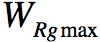
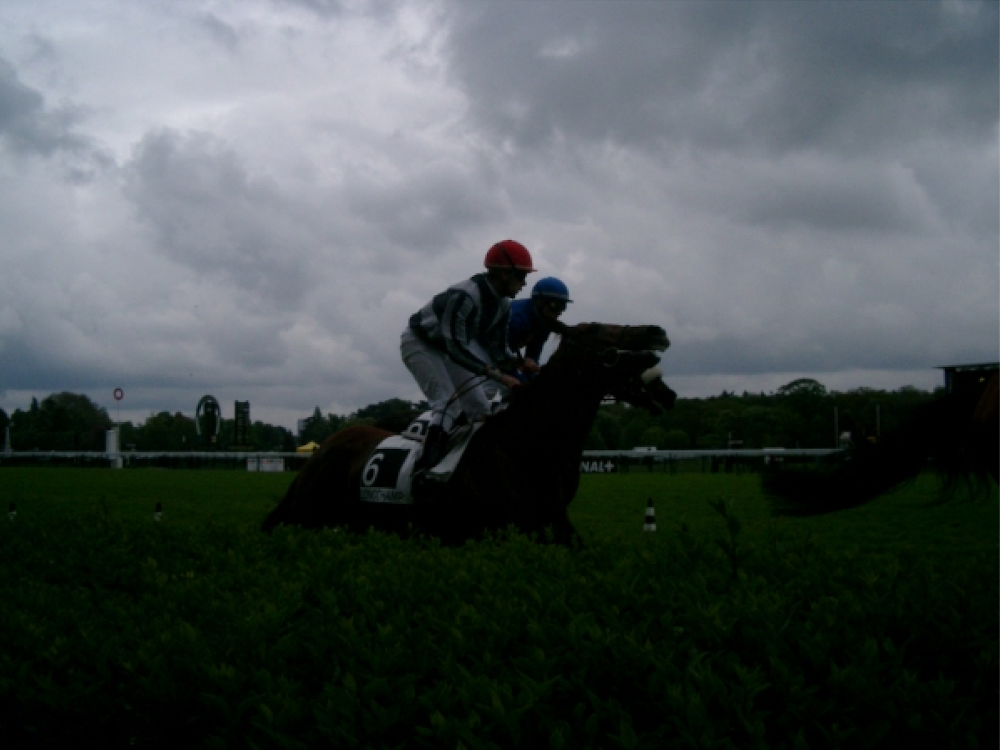
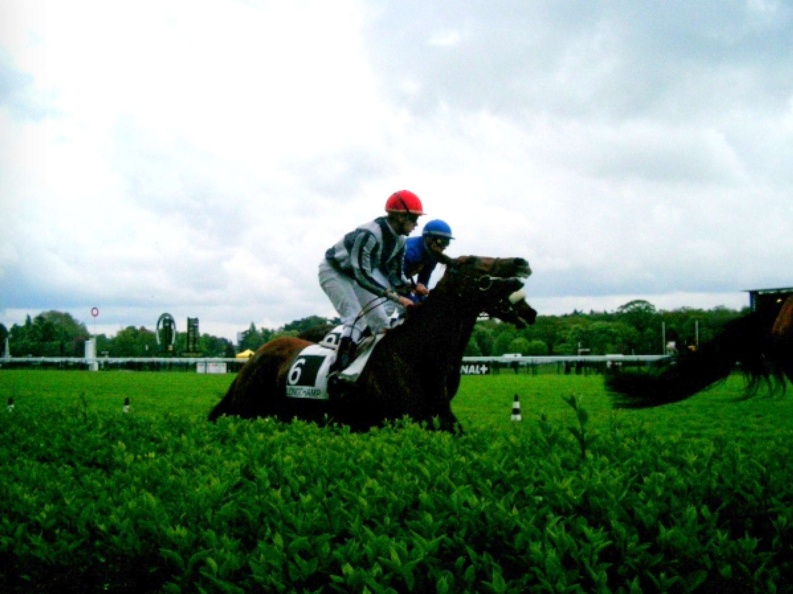

## Adaptive Local Tone Mapping Based on Retinex for HDR Image
This project is the Java implementation of the algorithm proposed. It is a new tone mapping technique for high dynamic range images based on the retinex theory. This algorithm consists of two steps, global adaptation and local adaptation of the human visual system. In the local adaptation process, the Gaussian filter of the retinex algorithms is substituted with a guided filter to reduce halo artifacts. To guarantee good rendition and dynamic range compression, a contrast enhancement factor based on the luminance values of the scene is used. In addition, an adaptive nonlinearity offset is introduced to deal with the strength of the logarithm function’s nonlinearity.

To make this algorithm performs better, some modifications are made based on the original methods. For the details of the algorithm propsed by the author, you'd better read the paper. Here only show some of the modifications.

**Maximum Filter**

In order to make the algorithm to deal with the low illumination image well, I apply a Maximum filter before the Gaussian blur.

**Contrast Enhancement Factor & Adaptive nonlinearly offset**

The contrast enhancement factor is given by:

  

where η denotes the contrast control parameter, and  is the maximum luminance value of the global adaptation output. The other, the adaptive nonlinearity offset which varies in accordance with the scene contents can be written as:

where λ is the nonlinearity control parameter, and  is the log-average luminance of the global adaptation output.
To make the result better, these nonlinear formula are modified.

<b>, and then, </b>

where η denotes the contrast control parameter, a controls the increasing rate of global contrast,  is the maximum luminance value of the global adaptation output, b is the shrinkage parameters to control the shape of Sigmoid function,  is the maximum value of contrast enhancement factor.

**Results and Statistics**

  

  

  

  

  
