## Single Image Haze Removal Using Dark Channel Prior
The dark channel prior dehazing is a simple but effective method to remove haze from a single input image. The dark channel prior is a kind of statistics of outdoor haze-free images. It is based on a key observation—most local patches in outdoor haze-free images contain some pixels whose intensity is very low in at least one color channel. Using this prior with the haze imaging model, it is able to directly estimate the thickness of the haze and recover a high-quality haze-free image.

### Results
##### Enhancement Example
  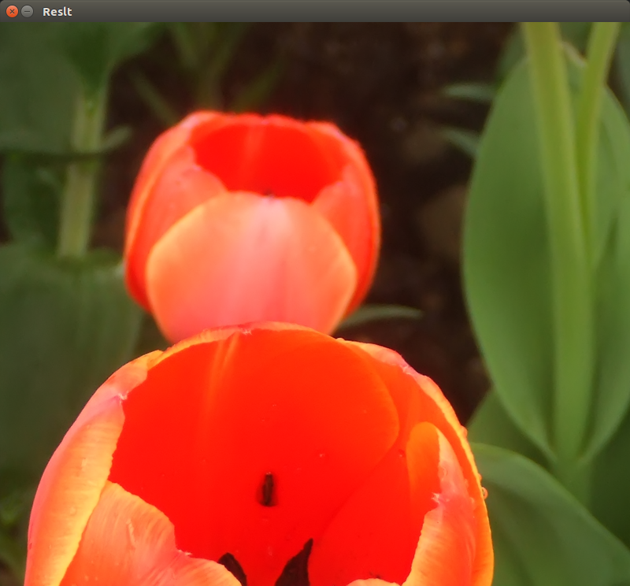

##### Feathering Example
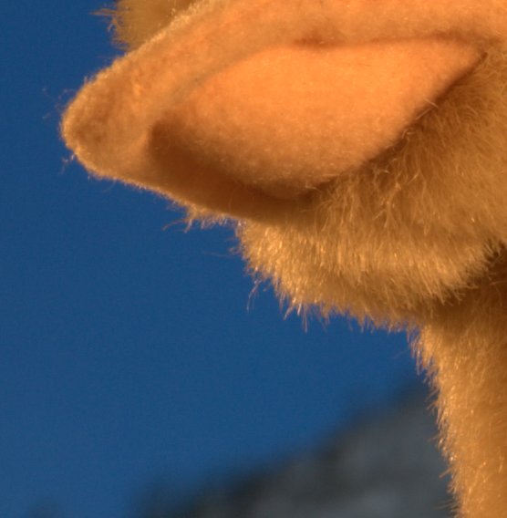    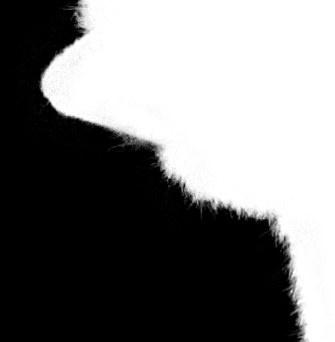

##### Flash Example
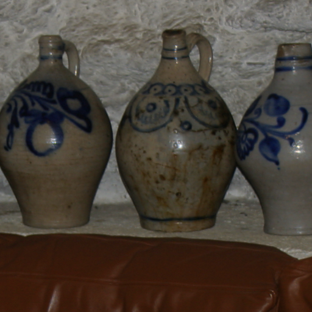    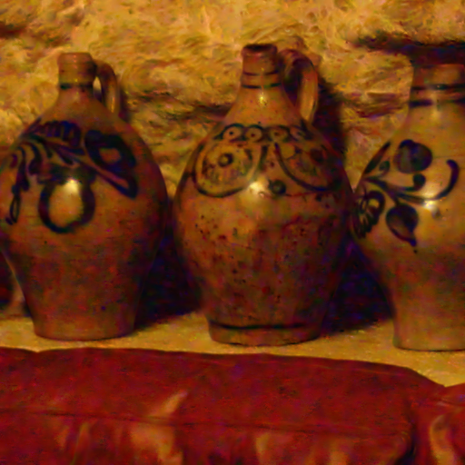

##### Haze Removal Results
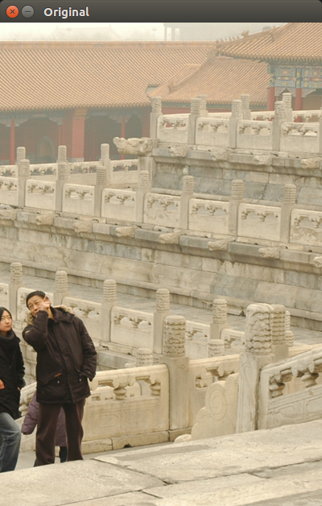  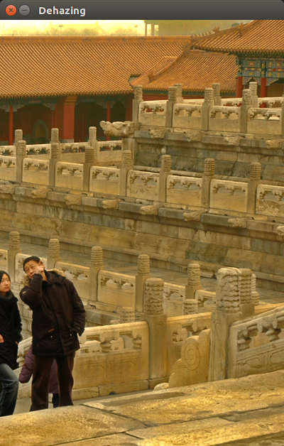

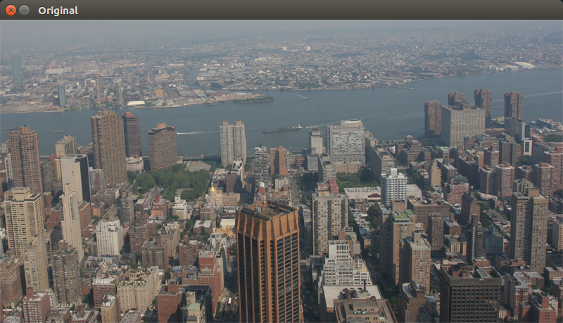  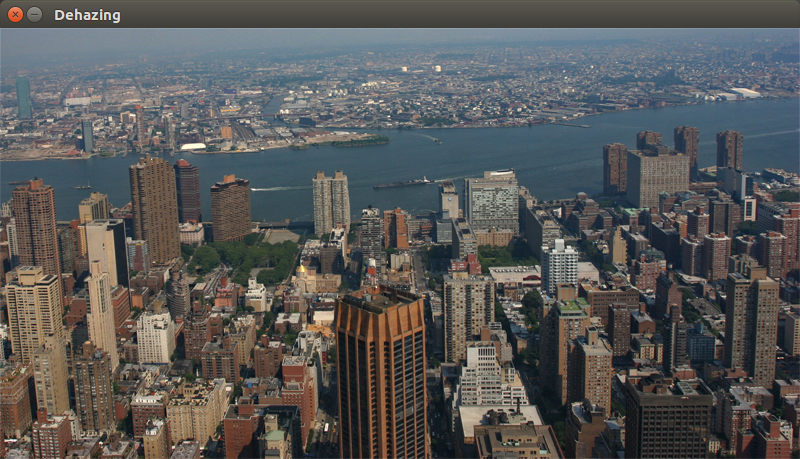

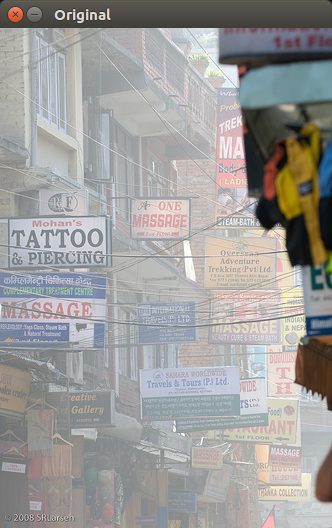  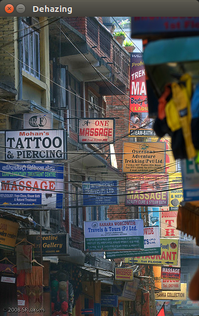

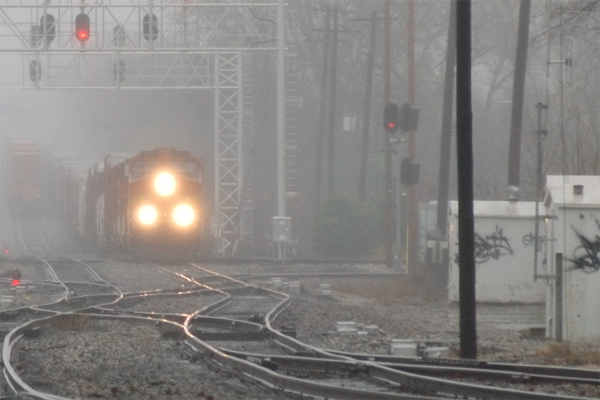  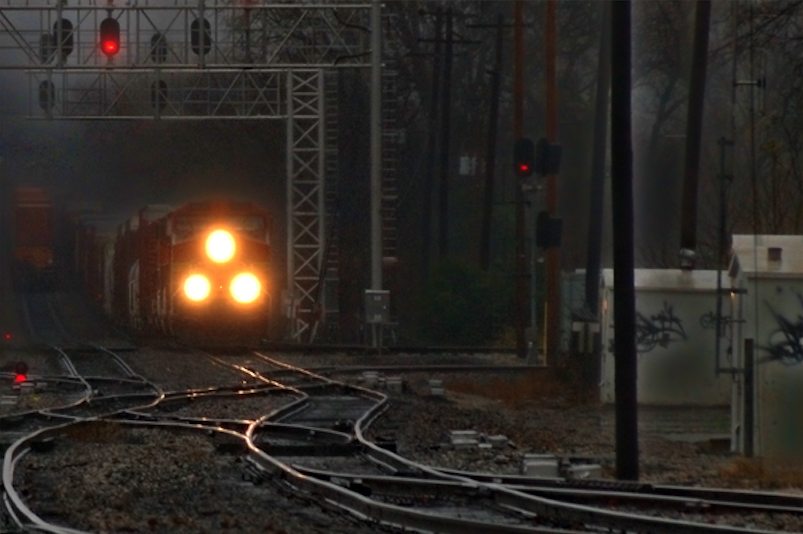
