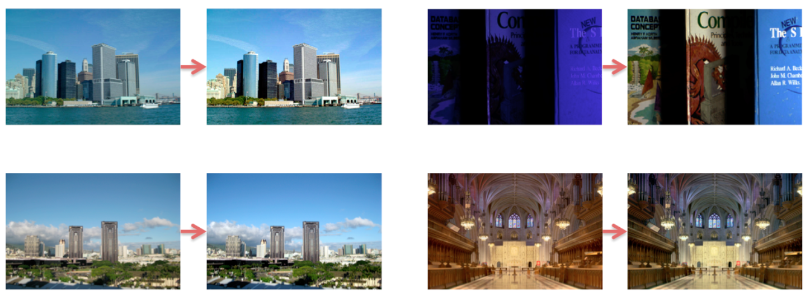
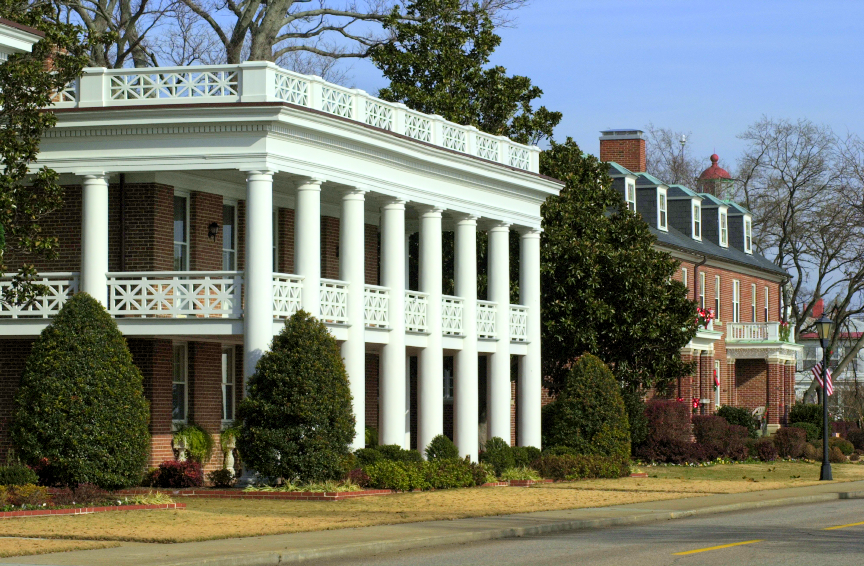

## Image Enhancement Based on Retinex and Dual-Tree Complex Wavelet Transform
The task of image enhancement is focus on restoring and clarifying the corrupted images to improve their quality, and image enhancement methods has been widely applied to numerous image analysis techniques including pattern recognition, image fusion, image segmentation, image compression and so forth. Among variety of image enhancement methods, algorithms based on Retinex theory have received more and more attentions and have been commonly used in many applications.

Here I describe a Retinex theory based method for contrast and illuminance enhancement in images of low light or unevenly illuminated scenes. This method firstly transforms image from RGB color space to HSV color space, and decomposes the value channel using dual-tree complex wavelet transform. Then, an improved adaptive local tone mapping method is used to process the low frequency component of the image, and wavelet shrinkage method and fuzzy enhancement method are applied to denoise and enhance the high frequency component of the image. After that, the enhanced value channel is reconstructed and a statistical histogram optimization method is used. Finally, the enhanced image is transformed back to RGB color space.

### RGB Color Space to HSV Color Space

### Dual-Tree Complex Wavelet Transform (DT-CWT)
 

### Simplest Color Balance Example

### Results
##### Restoration Example
  

##### Enhanced Result Compare to Other Algorithms

##### Histograms of different methods
 

##### Details

##### Results of different methods compare to reference

 
