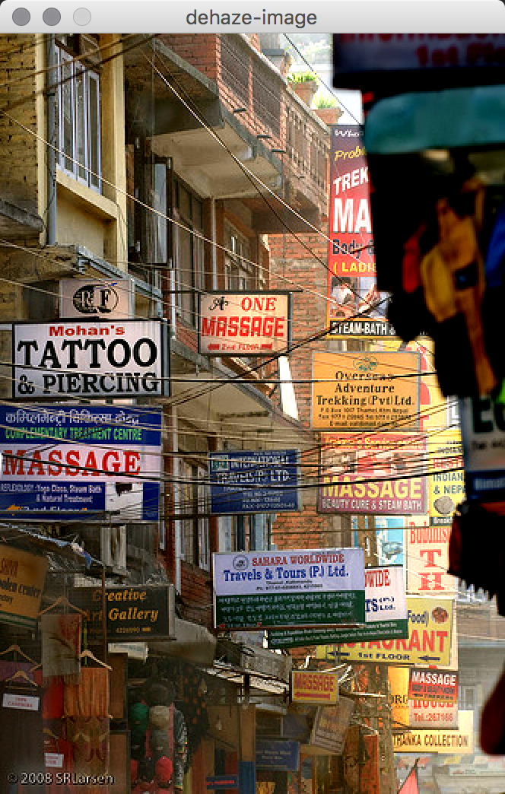
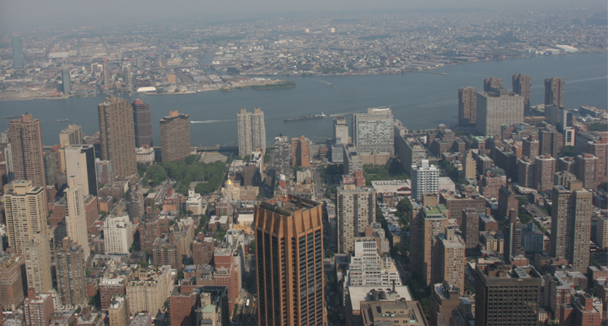

## Optimized Contrast Enhancement for Real-time Image and Video Dehazing
It is a fast and optimized dehazing algorithm for hazy images and videos is proposed in this work. Based on the observation that a hazy image exhibits low contrast in general, they restore the hazy image by enhancing its contrast. However, the overcompensation of the degraded contrast may truncate pixel values and cause information loss. Therefore, they formulate a cost function that consists of the contrast term and the information loss term. By minimizing the cost function, the proposed algorithm enhances the contrast and preserves the information optimally. Moreover, they extend the static image dehazing algorithm to real-time video dehazing. They reduce flickering artifacts in a dehazed video sequence by making trans- mission values temporally coherent.

### Results
##### Airlight Selection

##### Haze Removal Results
  
  

  
  

  
  

  
  
