## Removing Backscatter to Enhance the Visibility of Underwater Object
[Underwater vision enhancement](https://en.wikipedia.org/wiki/Underwater_computer_vision) via backscatter removing is widely used in ocean engineering. With increasing ocean exploration, underwater image processing has drawn more and more attention due to the important roles of video and image for obtain information. However, due to the existence of dust-like particles and light attenuation, underwater images and videos always suffer from the problems of low contrast and color distortion. In this thesis, we analyze the underwater light propagation process and propose an effective method to overcome the backscatter problem.

This method is based on the underwater optical model and image fusion. It mainly contains three steps, first, we decompose input image into reflectance and illuminance components; second, we utilize color correction technology and dehazing technology to handle these two components separately; finally, in order to rebuild result well, we applied the Gaussian and Laplacian pyramids based multi-scale fusion to reconstruct the target image, while Exposedness, Saliency and Laplacian contrast maps are utilized as weights to assist the fusion task.

### Description

##### Light Attenuation and the Physical Model of Light Propagation Underwater
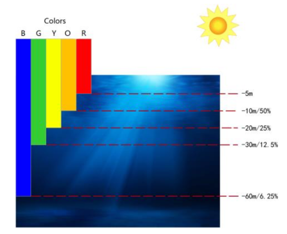  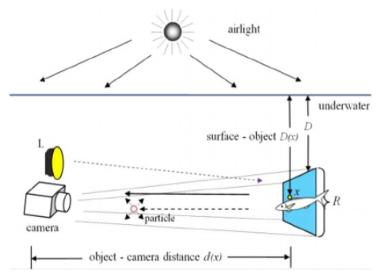

##### The Procedures of Objects Visibility Enhancement Process
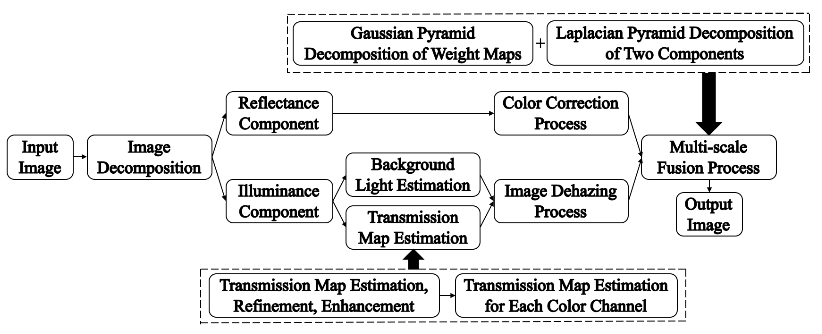

##### Image Decomposition and Background-Light Selection
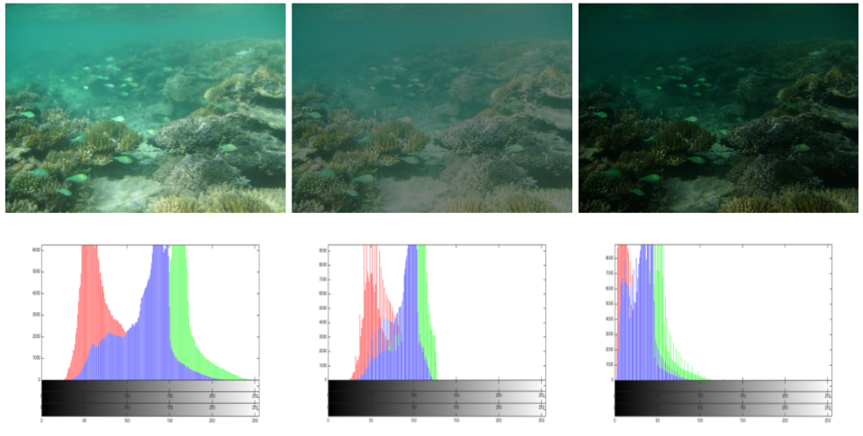  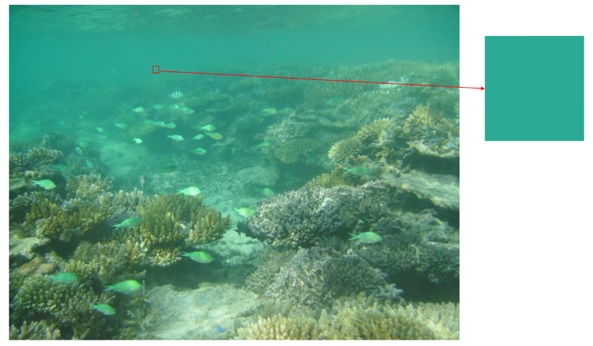

##### Coarse, Refined and Enhanced Transmission Map
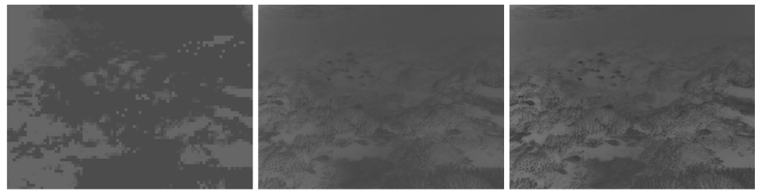

##### Transmissiom Map of Three Color Channel
left to right: red channel, green channel and blue channel

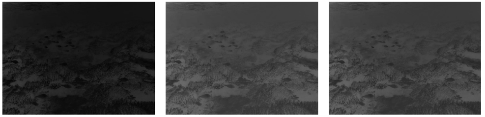

##### Restored Results of Illuminance and Reflectance Components
left: reflectance component, right: illuminance component

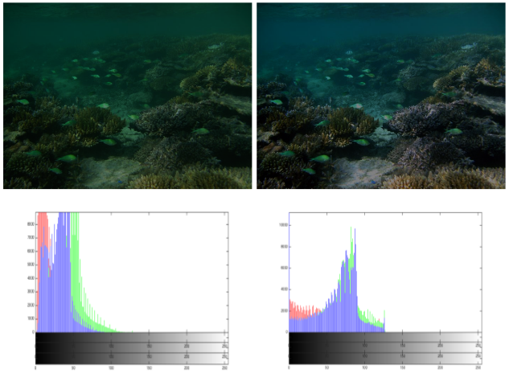  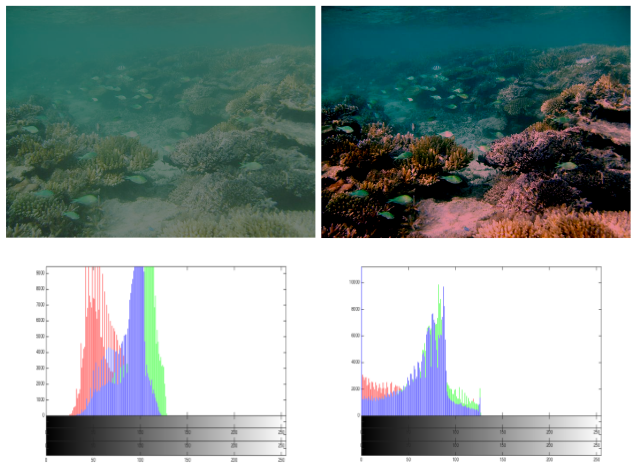

##### Normalized Weight Maps of Two Components
left: reflectance component, right: illuminance component

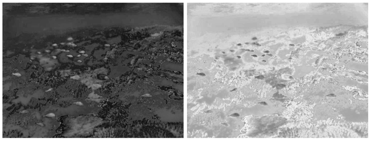

##### Multi-scale Fusion Result
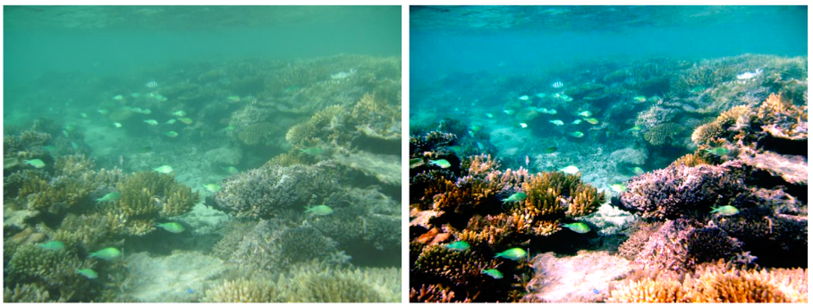

### Some Results

**NOTE**: For more details of results and analysis, see [**analysis.pdf**](analysis.pdf).

##### Original Images
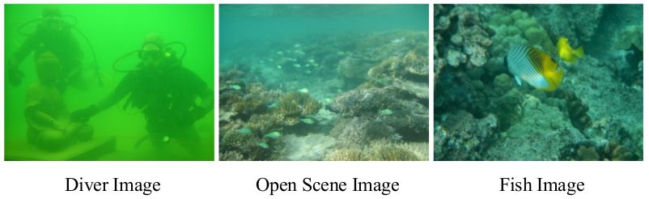

##### Restored Results with different methods
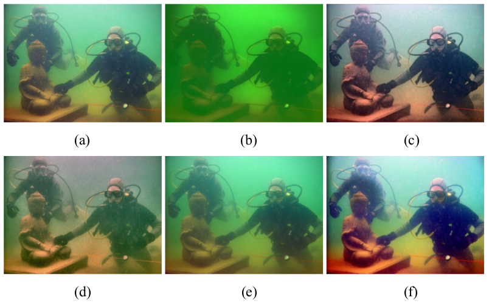

**Note**: (a) ACE. (b) Histogram equalization (HE). (c) Fu et al. (d) Ancuti et al. (e) Galdran et al. (f) our method.

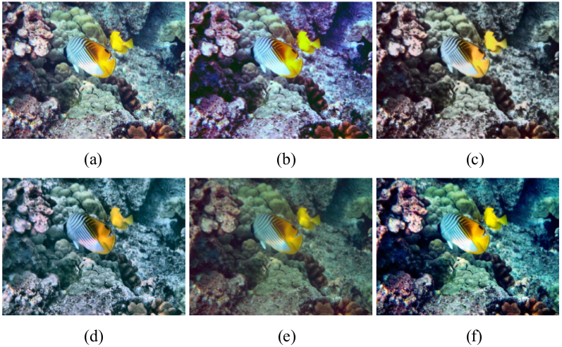

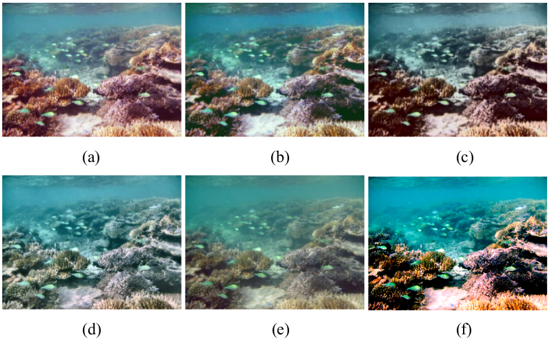

##### RGB Color Space Mapping Results
left: color space of diver image, right: color space of fish image

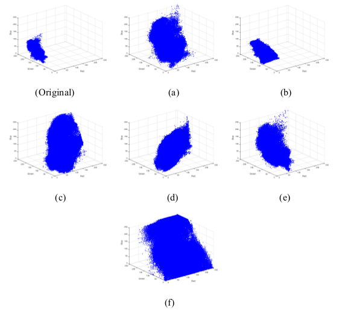     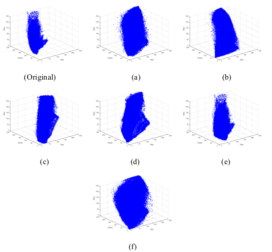
